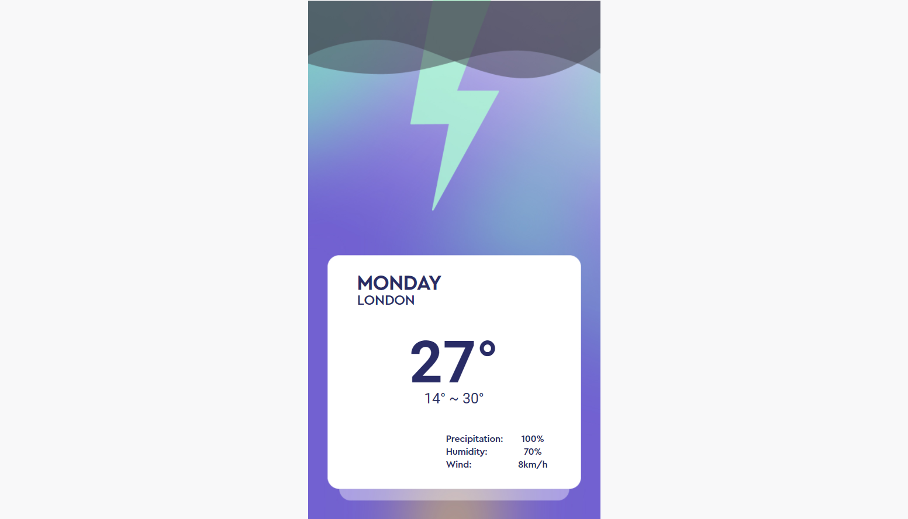

## Project ideal
The pet project for learning Vue3 (Use VueCLI & fetch native & composition API)<br>
<p></p>
<br/>

Feature include:
- Using `scss`, `font`, `fetch`, `VueCLI`, `VueRouter`, `openweatherAPI`

## Project setup
```
npm install
npm run serve
npm run build
npm run lint
```
